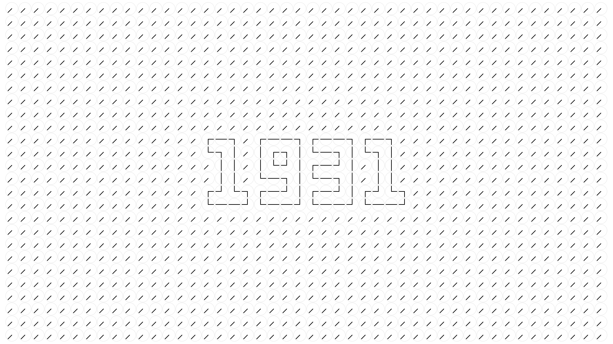
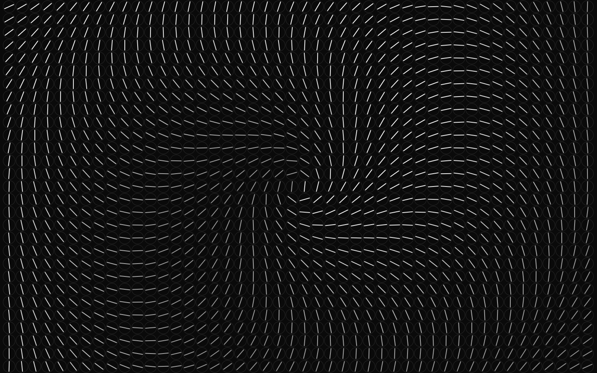
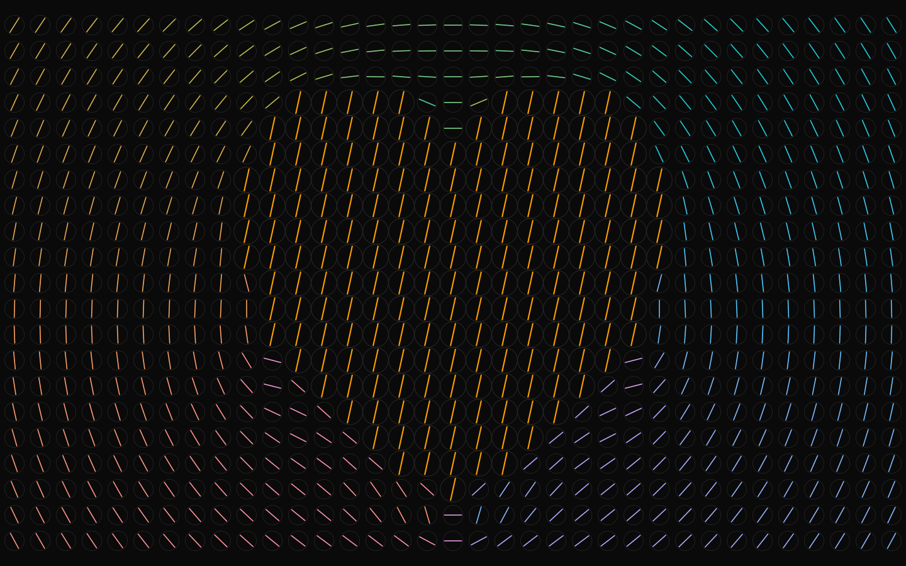

# clockwise

A wall of analog clocks that together tell the time.

Now and then the wall glitches: every clock breaks away into a shared pattern, holds it for a few seconds, then springs back to the time.
Made to sit on a second screen and catch your eye when you look back at it.







## Run it

```sh
pnpm install
pnpm dev
```

Open the URL Vite prints.
A bigger window means more clocks.

## Modes

- **Classic** (`/`): grayscale.
  Shows the time and glitches into a pattern every 1-3 minutes.
  While the window is out of focus, it plays patterns back to back.
- **Trip** (`/trip`): colors, gently swelling clocks and love-themed patterns on a loop, with the time showing for a few seconds in between.

## Keys

| Key | Action                                                 |
| --- | ------------------------------------------------------ |
| `w` | Play patterns back to back, same as leaving the window |
| `g` | Glitch now                                             |
| `d` | Switch between light and dark                          |

The theme follows the system until you press `d`.
With reduced motion turned on, hands snap into place and patterns never play.

## Embed it

```svelte
<script lang="ts">
	import { CLASSIC } from '$lib/game/modes';
	import ClockWall from '$lib/ui/ClockWall.svelte';
</script>

<div style="height: 16rem">
	<ClockWall mode={CLASSIC} />
</div>
```

The wall fills its container.

## How it works

The wall is an ECS in `src/lib/game/`.
Each grid cell is an entity, and components are typed arrays (`Float32Array` per field), so there are no objects per clock.
One `requestAnimationFrame` loop runs the systems in order:

1. `sys_glitch`: starts and ends patterns, and points hands along the running one.
2. `sys_time`: points the remaining hands at the current HH:MM.
3. `sys_reveal`: fades the wall in as a diagonal wave on load.
4. `sys_spring`: moves every hand on a critically damped spring, always clockwise.
5. `sys_draw`: draws every clock in one instanced WebGL2 call, only when something moved.

A 4K wall (~5000 clocks) holds 120fps with the main thread about 2% busy.

## Add a pattern

A pattern is a function in `src/lib/game/modes.ts`.
It gets a clock's offset from the wall center (`x`, `y`, in cells), the seconds since the pattern started (`t`) and half the shorter wall side (`span`).
It returns both hand angles in degrees, plus an optional clock size.

```ts
// Diagonal wave rolling across the wall.
const wave: Pattern = (x, y, t) => [
	...line((x + y) * 15 + t * 120),
	swell((x + y) * 0.3 - t * 1.2)
];
```

Add it to a mode's `patterns` list.
A mode is a plain object in the same file: which patterns it plays, how long patterns and the time show, and whether it uses colors and sizes.

## Tuning

- `HAND_FREQUENCY` in `src/lib/game/components.ts`: how snappy hands are.
- `swell()` in `src/lib/game/modes.ts`: how much and how fast clock sizes change.
- `THEMES` and the `tint()` shader in `src/lib/game/sys_draw.ts`: colors and grayscale shading.

## Scripts

- `pnpm test`: plays every pattern headless and fails if a hand turns backwards, the time does not come back, or sizes pulse. Needs Node 22.18 or later.
- `pnpm check`: type check.
- `pnpm lint`: Prettier and ESLint.
- `pnpm build`: production build.
